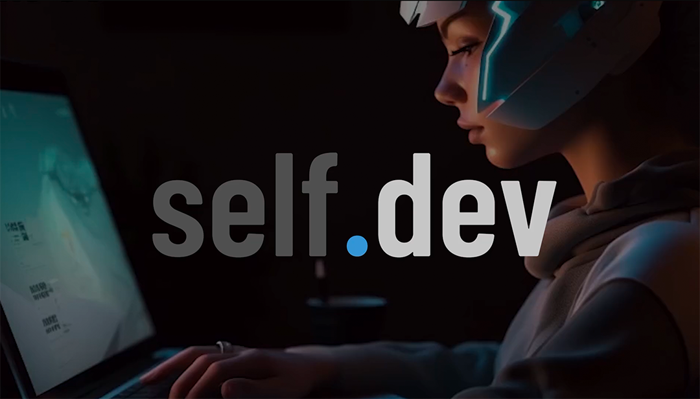

[](content/imgs/selfdev_intro/discord_sage_logo_bannershort.mp4)

sudo npm install -g yarn


# Introduction

Welcome to the self.dev blog! Our blog is dedicated to exploring various topics related to self-development, programming, mindset improvement, hands-on tech tutorials, and current trends in the data and AI space. Whether you're a programmer looking for coding tips, someone interested in personal growth, or curious about the latest advancements in technology, our blog has something for everyone. Join us as we delve into the exciting world of self.development!

# Setup

To get started with the self.dev blog, follow these simple steps:

Install the necessary dependencies by running the command 

``` ssh
yarn install
```


Launch the development server with 

``` ssh 
yarn run develop
```

Access the blog through your preferred web browser.

By following these setup instructions, you'll have the blog up and running in no time, ready to explore the engaging content we have to offer.

# How to Write a New Blog Post:

Creating a new blog post for the selfdev community is easy! Just follow these steps:

1. Begin by starting a Pull Request on the repository.
2. Navigate to the appropriate folder for the topic you want to write about (e.g., `content/blockchain`).
3. Create a new .mdx file with a descriptive name for your blog post (e.g., `are-nfts-the-biggest-scam-of-2022.mdx`).
4. Copy the template from an existing blog post file and paste it into your newly created file.
5. Customize the title and description properties to reflect the focus of your blog post.
6.Use Markdown syntax to write your content, sharing your thoughts, insights, and expertise with the selfdev community.

Here is a template:

``` md
---
title: 'Are NFTs the biggest scam of 2022?'
description: 'People make millions out of NFTs and today I am discussing if it's just another ponzi scheme or comes with a future.'
---

<YOUR CONTENT IN MARKDOWN FORMAT>
```

Don't forget to add images to enhance your blog post! If you're using local images, place them under the content/images folder. To include an image in your blog post, use the following Markdown syntax:

``` md

```

# Who Can Contribute:

At self.dev, we believe in the power of community collaboration. As such, only NEXT LEVEL members have the privilege to contribute to our blog. If you gained the trust and the NEXT LEVEL role, we invite you to share your knowledge, experiences, and ideas by creating and publishing blog posts. Your valuable contributions will help inspire and educate fellow members, fostering a culture of growth and learning within our community.

Join our [Discord](https://discord.gg/selfdev) server and learn [here](https://discord.com/channels/768200129060536340/896887033874751509) how you can gain the NEXT LEVEL role.

Feel free to use these content snippets as a starting point and customize them to fit the specific style and tone of your blog.